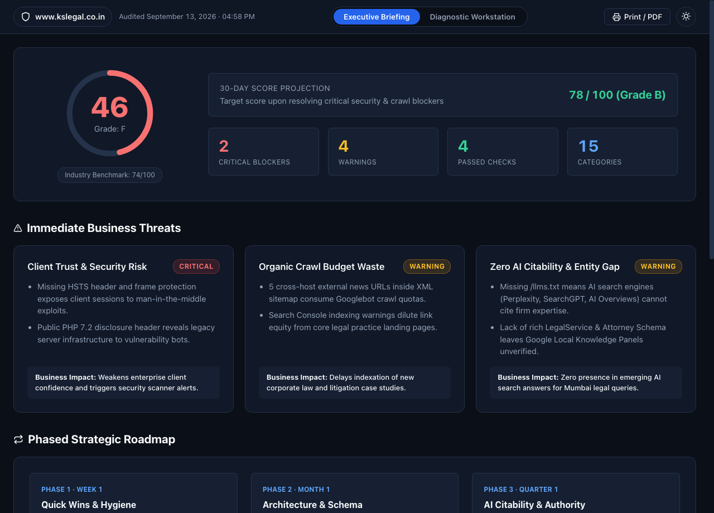
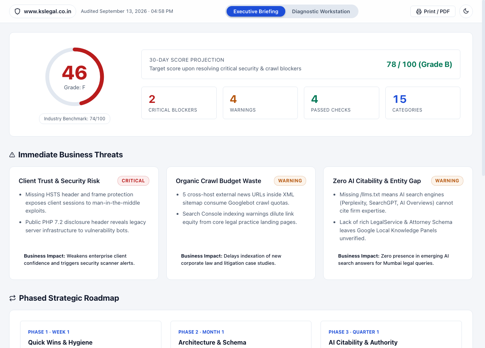
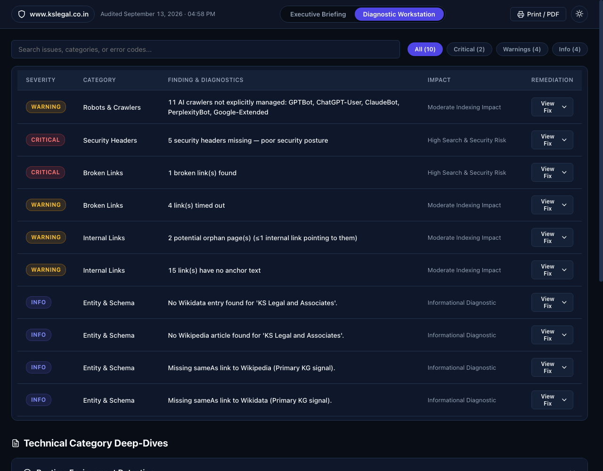

# KS Legal & Associates — SEO & Entity Intelligence Diagnostic Workstation

[](https://github.com/Blackx16/kslegal-seo-report/stargazers)
[](LICENSE)
[](https://github.com/Blackx16/kslegal-seo-report/issues)
[](https://blackx16.github.io/kslegal-seo-report/)

An authoritative, production-grade **SEO audit**, technical SEO telemetry workstation, and entity intelligence diagnostic suite for **KS Legal & Associates** ([https://www.kslegal.co.in/](https://www.kslegal.co.in/)).

This repository contains comprehensive diagnostic findings across Google YMYL E-E-A-T criteria, Schema.org structured data, Core Web Vitals, crawl architecture, and Generative Engine Optimization (GEO) for modern AI search engines including ChatGPT Search, Perplexity AI, Claude, and Google AI Overviews.

---

## 🌐 Live Interactive Workstation

Explore the deployed dual-lens workstation directly in your browser:
👉 **[https://blackx16.github.io/kslegal-seo-report/](https://blackx16.github.io/kslegal-seo-report/)**

Toggle seamlessly between the **Executive Briefing** (risk exposure, commercial upside, and timeline) and the **Diagnostic Workstation** (filterable cross-category triage matrix with copy-paste code remediation drawers).

---

## Executive Audit Summary

- **Target Domain**: `https://www.kslegal.co.in/`
- **Industry Vertical**: Legal Services & Corporate Advisory (Google YMYL — Your Money or Your Life)
- **Primary Geographies**: Mumbai, Maharashtra, India (Nariman Point & Bandra Kurla Complex)
- **Hosting Stack**: WordPress on LiteSpeed Web Server / Hostinger
- **Audit Date**: September 2026
- **Current SEO Health Score**: **`46 / 100`** *(Grade: D+)*
- **Core Web Vitals Status**: Poor TTFB (1.8s+), INP optimization required, render-blocking scripts
- **Projected Score Post-Remediation**: **`85+ / 100`** within 90 days

---

## Diagnostic Scorecard & Baseline Metrics

| Category | Score | Primary Finding | Immediate Remediation |
|---|:---:|---|---|
| **Architecture & Crawl** | 60% | XML sitemap contaminated with external news links; slow TTFB | Purge external URLs; configure LiteSpeed cache |
| **Security & Headers** | 40% | Missing HSTS, CSP, X-Frame-Options; exposed PHP version | Inject hardened security headers in `.htaccess` |
| **On-Page & Intent** | 35% | Keyword stuffing across title tags; thin practice pages (<350 words) | Rewrite titles for CTR; expand practice authority hubs |
| **Legal YMYL & E-E-A-T** | 45% | Unsubstantiated superlatives; missing comprehensive advocate bios | Add Bar Council compliance disclaimer & lawyer profiles |
| **Entity & Schema.org** | 20% | Zero `LegalService` / `Attorney` schema markup | Deploy validated JSON-LD with geo-coordinates & founders |
| **Local SEO & Maps** | 30% | Title conflict (Andheri vs Nariman Point); missing map embeds | Align GBP citations and embed localized map pins |
| **AI Search (GEO / AEO)** | 10% | No `/llms.txt`; unmanaged AI crawlers; thin answer passages | Publish structured `llms.txt` and passage-level Q&A |
| **Internal Link Equity** | 55% | 16 "Read More" generic anchors; 15 blank anchors; orphan pages | Implement descriptive topical anchor text matrix |

---

## Screenshots, Report Preview & Interactive Telemetry Dashboard

The workstation is built around an instrument telemetry interface engineered for instant executive comprehension and zero-friction developer remediation.

### Executive Risk Dossier (Dark Mode)


### Corporate Executive Briefing (Light Mode)


### Cross-Category Triage Workstation Matrix


---

## Quickstart & Local Setup

Clone the repository and preview the interactive workstation locally:

```bash
git clone https://github.com/Blackx16/kslegal-seo-report.git
cd kslegal-seo-report
python3 -m http.server 8080
open http://localhost:8080
```

Alternatively, you can open `index.html` directly in any modern browser without a web server.

---

## Repository Deliverables & Architecture

1. **[`index.html`](index.html)**: Production dual-lens interactive dashboard featuring real-time search, severity filtering (Critical, Warning, Info), and syntax-highlighted code remediation drawers.
2. **[`KSLEGAL-FULL-AUDIT-REPORT.md`](KSLEGAL-FULL-AUDIT-REPORT.md)**: Exhaustive 20KB technical document detailing crawlability, YMYL E-E-A-T signals, BCI regulatory guidelines, security vulnerabilities, and on-page content defects.
3. **[`KSLEGAL-ACTION-PLAN.md`](KSLEGAL-ACTION-PLAN.md)**: Four-phase 90-day execution roadmap (Immediate Quick Wins → Architecture & CWV → Practice Area Hubs → AI Search Authority).
4. **[`KSLEGAL-LEGALSERVICE-SCHEMA.json`](KSLEGAL-LEGALSERVICE-SCHEMA.json)**: Production Schema.org JSON-LD structured data with dual `@type: ["LegalService", "Attorney"]`, office geo-coordinates, Bar Council disclosures, and service catalogs.
5. **[`KSLEGAL-LLMS.txt`](KSLEGAL-LLMS.txt)**: Optimized `/llms.txt` standard file enabling structured ingestion for ChatGPT, Claude, Perplexity, and Gemini.
6. **[`audit-kslegal.json`](audit-kslegal.json)**: Raw machine-readable diagnostic fixture across all 14 evaluated technical dimensions.
7. **[`DESIGN.md`](DESIGN.md)**: Visual specification detailing the High-Density Telemetry aesthetic, status color channels, and component hierarchy.
8. **[`PRODUCT.md`](PRODUCT.md)**: Product scope, user persona mappings, and dual-lens UX specification.

---

## Top 4 Immediate Action Items

1. **Purge External URLs from `sitemap.xml`**: Strip non-domain media coverage URLs to stop wasting search engine crawl budgets.
2. **De-Spam Homepage & Practice Area Titles**: Replace mechanical keyword stuffing with high-CTR, intent-focused title tags.
3. **Deploy Security Headers in `.htaccess`**: Configure HSTS, Content-Security-Policy, and X-Frame-Options to elevate security score from 40 to 95+.
4. **Inject LegalService Schema & Publish `/llms.txt`**: Add rich structured data into page templates and serve `/llms.txt` at the root domain.

---

## Contributing, Issues & Community Support

Contributions, feedback, and issue reports are warmly welcomed!

- **Found a bug or incorrect finding?** Please open an [Issue](https://github.com/Blackx16/kslegal-seo-report/issues) using our pre-built issue templates.
- **Want to submit improvements?** Check out our [Contributing Guidelines](.github/CONTRIBUTING.md) and submit a [Pull Request](https://github.com/Blackx16/kslegal-seo-report/pulls).
- **Security Concerns?** Read our [Security Policy](.github/SECURITY.md) for confidential disclosure instructions.
- **Support & Questions**: See [SUPPORT.md](.github/SUPPORT.md).
- **Show your support**: If you find this audit framework useful, give this repository a ⭐️ star!

---

## License

This project is licensed under the **MIT License** — see the [LICENSE](LICENSE) file for complete details.

---

*Generated by [Antigravity SEO Engine](https://github.com/Blackx16/companyseo) • Telemetry & Diagnostic Workstation v1.0.0*
